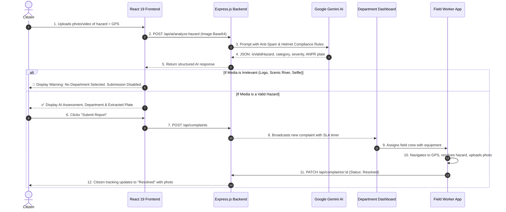

# 🏙️ AapdaSetu — AI-Powered Smart City Public Hazard Intelligence & Municipal Governance Platform

[](https://www.typescriptlang.org/)
[](https://react.dev/)
[](https://expressjs.com/)
[](https://ai.google.dev/)
[](https://tailwindcss.com/)
[](https://leafletjs.com/)

AapdaSetu is an end-to-end municipal intelligence and civic grievance platform designed for smart cities. It bridges citizens, municipal departments, field ground crews, and city leadership through multimodal AI vision analysis, automated geospatial triage, automatic license plate recognition (ANPR), and real-time resolution tracking.

---

## 📑 Table of Contents

1. [Project Overview](#-project-overview)
2. [Problem Statement & Real-World Use Case](#-problem-statement--real-world-use-case)
3. [Key Features: Basic to Advanced](#-key-features-basic-to-advanced)
   - [1. Multimodal AI Hazard Vision Assessment](#1-multimodal-ai-hazard-vision-assessment)
   - [2. Intelligent Media Gatekeeper & Anti-Spam Verification](#2-intelligent-media-gatekeeper--anti-spam-verification)
   - [3. Traffic Violation & Smart Helmet Compliance Isolation](#3-traffic-violation--smart-helmet-compliance-isolation)
   - [4. Automated License Plate Recognition (ANPR)](#4-automated-license-plate-recognition-anpr)
   - [5. Automated Department Auto-Routing & SLA Management](#5-automated-department-auto-routing--sla-management)
   - [6. Geospatial GIS Hazard Mapping & 300m Duplicate Detection](#6-geospatial-gis-hazard-mapping--300m-duplicate-detection)
   - [7. Multi-Role Portals & Field Worker App](#7-multi-role-portals--field-worker-app)
   - [8. Tri-Lingual Localization (English, Hindi, Marathi)](#8-tri-lingual-localization)
4. [System Architecture](#-system-architecture)
5. [End-to-End Workflow: How It Works](#-end-to-end-workflow-how-it-works)
6. [Tech Stack](#-tech-stack)
7. [Directory Structure](#-directory-structure)
8. [API Documentation](#-api-documentation)
9. [Local Development & Setup Guide](#-local-development--setup-guide)
10. [Environment Variables](#-environment-variables)
11. [Production Build & Deployment](#-production-build--deployment)

---

## 🌟 Project Overview

Traditional civic complaint platforms face three massive hurdles:
1. **Misrouted Complaints**: Citizens do not know whether an issue belongs to the Public Works / Road Department, Electricity Board, Water & Sewage Authority, or Sanitation Department.
2. **Spam & Non-Hazard Media**: Citizens inadvertently or maliciously upload selfies, company logos, scenic rivers, memes, or household items, overwhelming city staff.
3. **Traffic Enforcement Bottlenecks**: In dense traffic with dozens of two-wheelers, isolating the single rider without a helmet and extracting their registration number accurately is labor-intensive.

**AapdaSetu solves this completely using Google Gemini Multimodal Vision AI.** The system inspects citizen-uploaded photos and videos, verifies whether a genuine municipal hazard or traffic violation exists, extracts offender license plates (in standard `AA 00 AA 0000` format), flags emergency risks, calculates estimated fix times, and automatically dispatches tasks to the right department.

---

## 🎯 Problem Statement & Real-World Use Case

In a city of millions, thousands of civic issues emerge daily:
- **Potholes & Road Cave-Ins** causing fatal vehicular accidents.
- **Open High-Voltage Wires & Fallen Poles** posing electrocution risks.
- **Water Main Bursts** wasting thousands of liters of clean water.
- **Garbage Dumps & Blocked Drains** creating public health hazards and dengue outbreaks.
- **Traffic Offenses (No Helmet, Red Light Jumping, Wrong-Way Driving)** leading to traffic gridlock and fatalities.

AapdaSetu serves as the single digital command center connecting:
- **Citizens** (instant reporting with GPS, voice notes, photo/video, and live SMS/WhatsApp-style status tracking).
- **Municipal Departments** (dedicated control rooms for Roads, Electricity, Water, Waste, Safety, Traffic Police).
- **Field Ground Crews** (mobile task manager with GPS directions and before/after photo resolution upload).
- **City Commissioners & Analysts** (heatmaps, resolution times, SLA compliance, and department performance rankings).

---

## 🚀 Key Features: Basic to Advanced

### 1. Multimodal AI Hazard Vision Assessment
- **Zero-Guesswork Classification**: Citizen snaps a photo or records a video clip of a hazard. AapdaSetu feeds the visual evidence into Google Gemini Vision (`gemini-2.5-flash` with automatic failover to `gemini-3.1-flash-lite`).
- **Severity Scoring**: Categorizes risks as `Low`, `Medium`, `High`, or `Critical`.
- **Emergency Priority Escalation**: Hazards with imminent risk to human life (e.g., live dangling electrical wires, flooded open manholes) automatically trigger the `isEmergency` flag and alert emergency dispatch squads.
- **Estimated SLA Fix Hours**: Predicts estimated repair time (e.g., 2 hours for critical power line, 24 hours for minor pothole).
- **Contextual Safety Guidance**: Returns instant citizen advisory in the user's selected language (e.g., *"Keep 50m safe distance from fallen high-voltage lines"*).

### 2. Intelligent Media Gatekeeper & Anti-Spam Verification
- **Relevance Filter**: Inspects image contents to detect whether an image represents a real municipal defect.
- **Automatic Rejection of Irrelevant Media**:
  - Brand logos, corporate graphics, digital artwork, or software screenshots.
  - Clean natural rivers, scenic mountains, sunsets, beaches, or forests without visible pollution.
  - Personal selfies, human portraits, group photos, or domestic household pictures.
- **Disabled Submission State**: When non-hazard media is detected:
  - Department routing is set to **"No Department Assigned"**.
  - The "Submit Report" button is deactivated (`disabled`).
  - An informative alert explains why the media cannot be routed, directing the user to upload real civic defect evidence.
- **Server-Side Guardrail**: The Express backend enforces `isValidHazard !== false` check on `/api/complaints` to block unauthorized API payloads.

### 3. Traffic Violation & Smart Helmet Compliance Isolation
- **Multi-Vehicle Discrimination**: When an image or video contains multiple motorcycles or scooters:
  - The model inspects each rider and pillion passenger individually for helmet compliance.
  - **Law-abiding riders wearing helmets are protected and ignored.**
  - The AI isolates **only** the non-compliant rider committing a violation (e.g., riding without a helmet, triple riding, or driving on the wrong side).
  - The AI suggests official violation codes and legal fine amounts (e.g., ₹1,000 for helmet violation, ₹2,000 for wrong-way driving).

### 4. Automated License Plate Recognition (ANPR)
- **Standardized Number Plate Format**: Formats extracted plates strictly into `AA 00 AA 0000` (e.g., `MH 12 AB 1234`), aligning with high-security vehicle registration plate (HSRP) standards.
- **Mandatory Plate Enforcement**: For traffic violation complaints, the vehicle plate number is mandatory before submission is permitted, enabling instant traffic e-Challan generation.

### 5. Automated Department Auto-Routing & SLA Management
- Automatically routes verified complaints to one of 7 municipal departments:
  1. 🛣️ **Road Department** (Potholes, broken asphalt, damaged pavements)
  2. ⚡ **Electricity Department** (Open wires, transformer sparks, dark streetlights)
  3. 💧 **Water & Sewerage** (Burst pipelines, sewage overflows, contaminated supply)
  4. 🗑️ **Sanitation & Waste** (Garbage accumulation, animal carcasses, illegal dumping)
  5. 🌳 **Environmental Protection** (Fallen trees, toxic chemical/oil spills)
  6. 🛡️ **Public Safety & Infrastructure** (Open manholes, bridge cracks, structural damage)
  7. 🚦 **Traffic Police Department** (No helmet, signal jumping, obstructive illegal parking)
- Department dashboards track live SLAs, average resolution time, pending count, and crew dispatch state.

### 6. Geospatial GIS Hazard Mapping & 300m Duplicate Detection
- **Interactive Leaflet GIS Map**: Displays color-coded pins based on hazard severity and department.
- **Interactive Radius Circles**: Shows danger zones and active worker locations.
- **300-Meter Duplicate Detector**: When a citizen reports a hazard, the backend performs geospatial distance calculations (Haversine formula). If another complaint in the same category is active within 300 meters, it alerts the citizen:
  - Prevents redundant work orders.
  - Links the report as a vote/endorsement to increase the existing complaint's priority.

### 7. Multi-Role Portals & Field Worker App
- **Citizen Portal**: Multi-step wizard (Upload Media -> Location & Voice Note -> AI Review & Routing -> Confirmation).
- **Public Risk Map**: Open public heat map and emergency risk zone viewer.
- **Complaint Tracking**: Real-time status tracker (Submitted ➔ Under Review ➔ Assigned ➔ Crew Dispatched ➔ In Progress ➔ Resolved) with timeline logs and resolution photos.
- **Department Command Center**: Department heads can filter, assign officers, update repair progress, and upload resolution proof photos.
- **Field Worker Dashboard**: Field crews can view assigned jobs, tap to open GPS route in Google Maps, update on-site status, and take completion proof photos.
- **Executive Analytics**: City-wide Recharts visualizations (Resolution Rate, Department SLA Compliance, Hotspot Heatmaps, Category breakdowns).

### 8. Tri-Lingual Localization
- Full interface and AI-generated text localized in **English**, **Hindi (हिंदी)**, and **Marathi (मराठी)**.
- Gemini returns safety summaries and advice in the user's selected native language.

---

## 🏗️ System Architecture

```
                                  [ Citizen Mobile / Web Browser ]
                                                  │
                                  ┌───────────────┴───────────────┐
                                  ▼                               ▼
                     [ React 19 + Vite Frontend ]      [ Leaflet GIS Map View ]
                                  │
                                  ▼ (REST API calls)
                     [ Express.js Backend Server (Port 3000) ]
                                  │
               ┌──────────────────┼─────────────────────────┐
               ▼                  ▼                         ▼
      [ In-Memory Store ]   [ Google Gemini 2.5 ]   [ GIS Spatial Query ]
      - Complaints DB        - Vision Classification   - 300m Distance Filter
      - Worker Registry      - Anti-Spam Gatekeeper    - Cluster Calculator
      - Department KPIs      - ANPR Plate Extractor
                             - Helmet Compliance Check
```

---

## 🔄 End-to-End Workflow: How It Works



---

## 💻 Tech Stack

| Layer | Technology | Purpose |
| :--- | :--- | :--- |
| **Frontend UI** | **React 19**, **TypeScript**, **Vite** | Modern, fast reactive user interface |
| **Styling** | **Tailwind CSS v4** | Clean, responsive, high-contrast civic UI |
| **Animations** | **Motion** (`motion/react`) | Fluid step transitions and modal states |
| **Icons** | **lucide-react** | Clean accessible iconography |
| **GIS & Mapping** | **Leaflet**, **@types/leaflet** | OpenStreetMap-based spatial hazard mapping |
| **Charts & KPIs** | **Recharts** | Department performance, SLA compliance charts |
| **Backend** | **Node.js**, **Express 4.21** | Server-side REST API & middleware |
| **Language Runtime** | **tsx**, **esbuild** | Native TypeScript execution & bundled CJS builds |
| **AI Vision Engine** | **@google/genai** (Gemini 2.5 / 3.1) | Multimodal hazard triage, ANPR & relevance check |

---

## 📁 Directory Structure

```
├── package.json               # Node packages & build scripts
├── server.ts                  # Express API server + Gemini AI integration
├── metadata.json              # Application name, permissions & capabilities
├── .env.example               # Environment variables specification
├── index.html                 # Main entry HTML with Leaflet & Google Fonts
├── vite.config.ts             # Vite build & Tailwind plugin config
└── src/
    ├── main.tsx               # Application bootstrap
    ├── App.tsx                # Master routing & active view switcher
    ├── index.css              # Tailwind CSS imports & global styles
    ├── types.ts               # Shared TypeScript interfaces & models
    ├── context/
    │   └── LanguageContext.tsx# English, Hindi & Marathi localization context
    ├── utils/
    │   └── plateUtils.ts      # License plate formatters ('AA 00 AA 0000')
    └── views/
        ├── LandingView.tsx              # Smart City overview portal
        ├── ReportHazardView.tsx         # 4-step Citizen reporting wizard
        ├── PublicRiskMapView.tsx        # Public GIS heatmap & danger zones
        ├── LiveMapView.tsx              # Operations control room live map
        ├── ComplaintTrackingView.tsx    # Citizen real-time status tracker
        ├── DepartmentDashboardView.tsx  # Department heads command center
        ├── WorkerDashboardView.tsx      # Field crew mobile task runner
        ├── AnalyticsView.tsx            # City-wide KPI charts & resolution metrics
        └── AdminView.tsx                # Municipal commissioner administrative tools
```

---

## 🔌 API Documentation

### 1. AI Hazard Analysis
- **Endpoint**: `POST /api/ai/analyze-hazard`
- **Body**:
  ```json
  {
    "image": "data:image/jpeg;base64,...",
    "video": "data:video/mp4;base64,...",
    "description": "Deep pothole near university gate",
    "latitude": 18.5204,
    "longitude": 73.8567,
    "language": "en"
  }
  ```
- **Response**:
  ```json
  {
    "isValidHazard": true,
    "rejectionReason": "",
    "category": "Road Hazard",
    "subCategory": "Pothole",
    "severity": "High",
    "isEmergency": false,
    "confidenceScore": 96,
    "suggestedDepartment": "Road Department",
    "aiSummary": "Deep roadway pothole identified with high risk to two-wheelers.",
    "safetyAdvice": "Drive with caution and reduce speed to 20 km/h.",
    "estimatedFixHours": 12,
    "detectedVehiclePlateNumber": "",
    "violationType": "",
    "suggestedFineAmount": 0
  }
  ```

### 2. Duplicate Detection
- **Endpoint**: `POST /api/ai/check-duplicate`
- **Body**:
  ```json
  {
    "description": "Water leak",
    "latitude": 18.5204,
    "longitude": 73.8567,
    "category": "Water Hazard"
  }
  ```
- **Response**:
  ```json
  {
    "isDuplicate": true,
    "confidenceScore": 88,
    "matchedComplaintId": "SC-2026-4821",
    "reason": "Existing complaint active within 120 meters."
  }
  ```

### 3. Complaints CRUD
- `GET /api/complaints`: Retrieve all complaints with optional filtering by `category`, `status`, or `department`.
- `GET /api/complaints/:id`: Retrieve single complaint with full event history.
- `POST /api/complaints`: Create a new validated civic complaint.
- `PATCH /api/complaints/:id`: Update status (`In Progress`, `Resolved`), assign crew, or add resolution proof photo.

### 4. Department Analytics & KPIs
- `GET /api/departments/stats`: Returns open, in-progress, resolved counts and average resolution time per department.

---

## 🛠️ Local Development & Setup Guide

### Prerequisites
- **Node.js**: v18.0.0 or higher
- **npm**: v9.0.0 or higher
- **Google Gemini API Key**: Obtainable from [Google AI Studio](https://aistudio.google.com/)

### 1. Clone the Repository
```bash
git clone https://github.com/your-username/aapdasetu.git
cd aapdasetu
```

### 2. Install Dependencies
```bash
npm install
```

### 3. Configure Environment Variables
Create a `.env` file in the root directory:
```env
GEMINI_API_KEY=your_actual_gemini_api_key_here
PORT=3000
```

### 4. Start Development Server
```bash
npm run dev
```
Open your browser and navigate to:
```
http://localhost:3000
```

---

## ⚙️ Environment Variables

| Variable | Required | Description |
| :--- | :--- | :--- |
| `GEMINI_API_KEY` | **Yes** | Google Gemini API key used server-side for multimodal vision hazard triage. |
| `SUPABASE_URL` | Optional | Supabase project URL (defaults to `https://hflpnvixueffwbjbmnzh.supabase.co`). |
| `SUPABASE_ANON_KEY` | Optional | Supabase publishable anonymous key for persistent data storage. |
| `PORT` | Optional | Server port (defaults to `3000`). |

> **Security Note**: All Gemini API requests and database queries are executed strictly server-side in `server.ts`.

---

## 🗄️ Supabase PostgreSQL Database Setup

AapdaSetu automatically synchronizes citizen public hazard reports directly with a cloud-hosted Supabase PostgreSQL database.

- **Supabase Project ID**: `hflpnvixueffwbjbmnzh`
- **Database Endpoint**: `https://hflpnvixueffwbjbmnzh.supabase.co`

### Quick Database Schema Setup:
1. Open your [Supabase Dashboard](https://supabase.com/dashboard/project/hflpnvixueffwbjbmnzh).
2. Navigate to **SQL Editor** on the left navigation bar.
3. Click **New Query**, paste the contents of `supabase-schema.sql`, and click **Run**.
4. The `complaints` table will be created with Row-Level Security (RLS) policies allowing public hazard submissions from citizens and real-time department updates.

---

## 📦 Production Build & Deployment

### Compile and Build
```bash
npm run build
```
This script executes two tasks:
1. Compiles the frontend assets into `dist/` using Vite.
2. Bundles the Express TypeScript backend into `dist/server.cjs` using `esbuild`.

### Run Production Server
```bash
npm start
```

### Container / Docker Deployment
AapdaSetu binds to `0.0.0.0:3000`, making it directly compatible with container platforms such as **Google Cloud Run**, **AWS ECS**, or standard Docker containers.

```dockerfile
FROM node:20-alpine
WORKDIR /app
COPY package*.json ./
RUN npm install --production=false
COPY . .
RUN npm run build
EXPOSE 3000
CMD ["npm", "start"]
```

---

## 📄 License
This project is licensed under the [MIT License](LICENSE).

---

<div align="center">
  <sub>Built with ❤️ for Smarter, Safer, and Cleaner Cities powered by Google Gemini AI.</sub>
</div>
